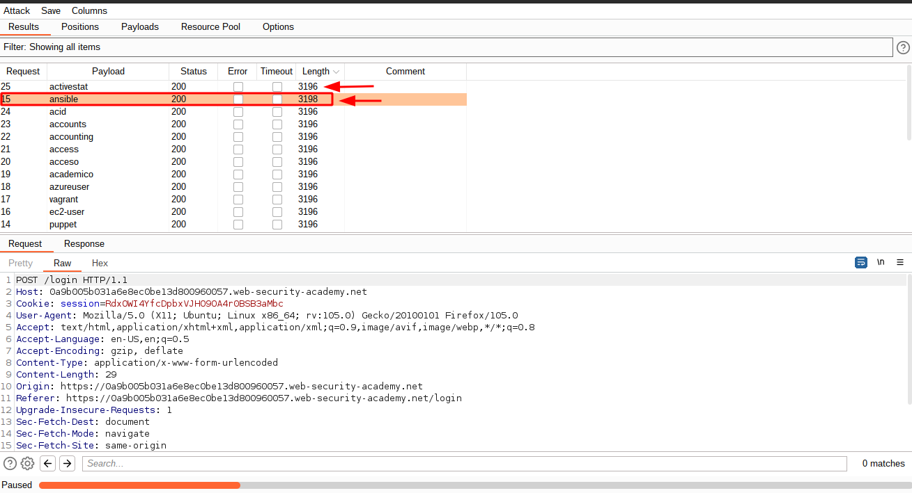
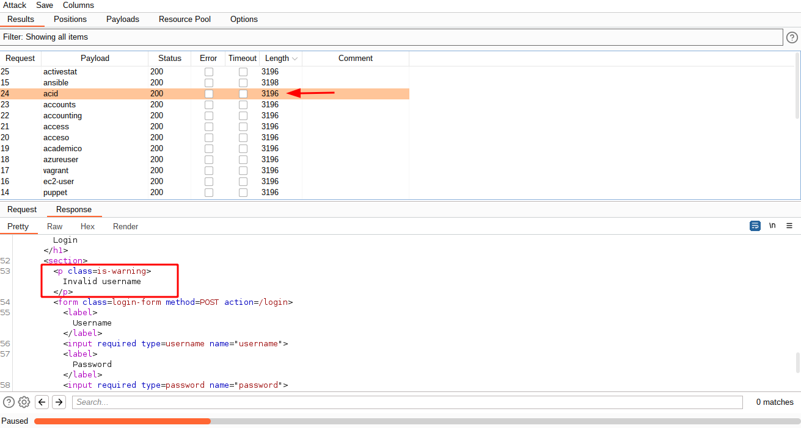
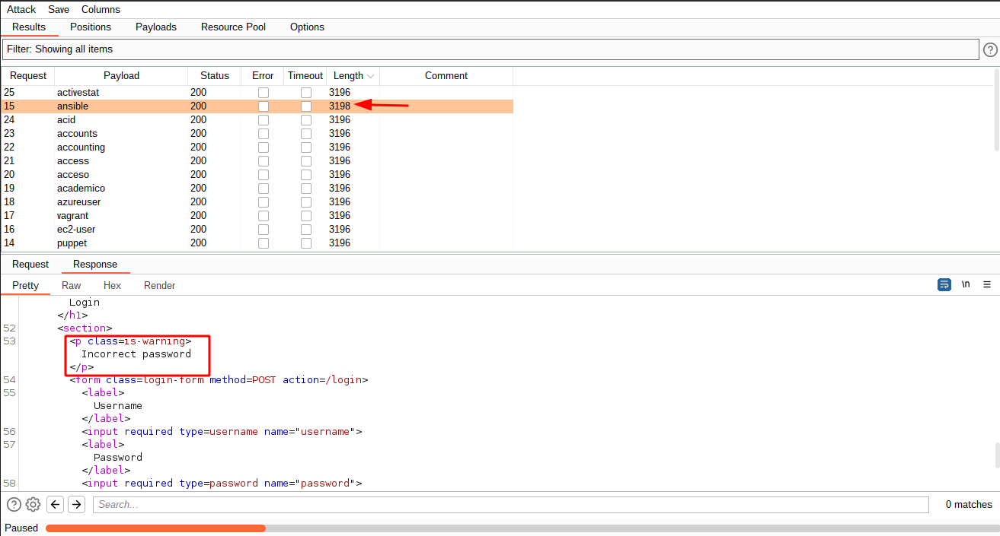
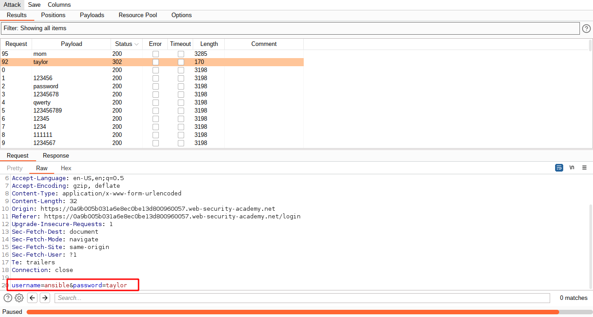
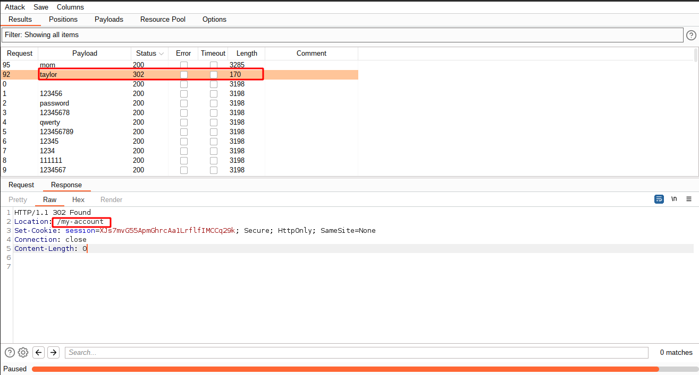
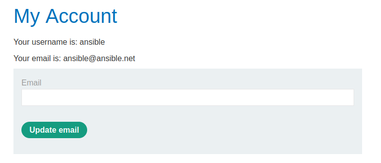

# Username enumeration via different responses

[Lab in PortSwigger](https://portswigger.net/web-security/authentication/password-based/lab-username-enumeration-via-different-responses)

## Definition
Username enumeration is when an attacker is able to observe changes in the website's behavior in order to identify whether a given username is valid.

Username enumeration typically occurs either on the login page, for example, when you enter a valid username but an incorrect password, or on registration forms when you enter a username that is already taken. This greatly reduces the time and effort required to brute-force a login because the attacker is able to quickly generate a shortlist of valid usernames.

While attempting to brute-force a login page, you should pay particular attention to any differences in:

- **Status codes**: During a brute-force attack, the returned HTTP status code is likely to be the same for the vast majority of guesses because most of them will be wrong. If a guess returns a different status code, this is a strong indication that the username was correct. It is best practice for websites to always return the same status code regardless of the outcome, but this practice is not always followed.
- **Error messages**: Sometimes the returned error message is different depending on whether both the username AND password are incorrect or only the password was incorrect. It is best practice for websites to use identical, generic messages in both cases, but small typing errors sometimes creep in. Just one character out of place makes the two messages distinct, even in cases where the character is not visible on the rendered page.
- **Response times**: If most of the requests were handled with a similar response time, any that deviate from this suggest that something different was happening behind the scenes. This is another indication that the guessed username might be correct. For example, a website might only check whether the password is correct if the username is valid. This extra step might cause a slight increase in the response time. This may be subtle, but an attacker can make this delay more obvious by entering an excessively long password that the website takes noticeably longer to handle.

## Notes
This lab is vulnerable to username enumeration and password brute-force attacks. It has an account with a predictable username and password, which can be found in the following wordlists:

 - [Candidate usernames](../../wordlist/usernames.txt)
 - [Candidate passwords](../../wordlist/passwords.txt)

To solve the lab, enumerate a valid username, brute-force this user's password, then access their account page.

**USERS ENUMERATION**  
In `Burp Suite`, intercept a login request and send that to the `Intruder` tab. Configure the attack type to `Sniper` and add a username as a payload marker. In the password value, put some invalid dummy password - it doesn't matter in this phase. The main goal here is to identify if the backend shows us a different response when a user exists but its password is wrong. In the `Payload` tab, choose `Simple list` as a type, load the [username wordlist](../../wordlist/usernames.txt) in it, and start the attack.

The image above presents the difference in a particular request. While all request has a content length of `3196 bytes`, a specific one has `3198 bytes`, slightly bigger than the others. This indicates that has some differences in the content of this response, as we can see in the images below:

With the username, let's reverse the logic to brute force the password. Using the same technique described in the previous step, replace the username with the one discovered in the attack and now use the password as a payload marker. In the `Payload` tab, load the [password wordlist](../../wordlist/passwords.txt) this time.

This time, there are two differences in one of the requests: the content length and the response status code. The status code `302` indicates that a redirection was made, in this case to the user's account page, after a successful login:

## Key Words
> brute force, user, enumeration, wordlist