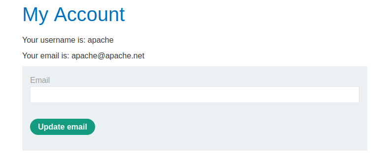

# Username enumeration via response timing

[Lab in PortSwigger](https://portswigger.net/web-security/authentication/password-based/lab-username-enumeration-via-response-timing)

## Definition
Username enumeration is when an attacker is able to observe changes in the website's behavior in order to identify whether a given username is valid.

Username enumeration typically occurs either on the login page, for example, when you enter a valid username but an incorrect password, or on registration forms when you enter a username that is already taken. This greatly reduces the time and effort required to brute-force a login because the attacker is able to quickly generate a shortlist of valid usernames.

While attempting to brute-force a login page, you should pay particular attention to any differences in:

- **Status codes**: During a brute-force attack, the returned HTTP status code is likely to be the same for the vast majority of guesses because most of them will be wrong. If a guess returns a different status code, this is a strong indication that the username was correct. It is best practice for websites to always return the same status code regardless of the outcome, but this practice is not always followed.
- **Error messages**: Sometimes the returned error message is different depending on whether both the username AND password are incorrect or only the password was incorrect. It is best practice for websites to use identical, generic messages in both cases, but small typing errors sometimes creep in. Just one character out of place makes the two messages distinct, even in cases where the character is not visible on the rendered page.
- **Response times**: If most of the requests were handled with a similar response time, any that deviate from this suggest that something different was happening behind the scenes. This is another indication that the guessed username might be correct. For example, a website might only check whether the password is correct if the username is valid. This extra step might cause a slight increase in the response time. This may be subtle, but an attacker can make this delay more obvious by entering an excessively long password that the website takes noticeably longer to handle.

## Notes
This lab is vulnerable to username enumeration using its response times. To solve the lab, enumerate a valid username, brute-force this user's password, then access their account page.

- Your credentials: `wiener:peter`
- [Candidate usernames](../../wordlist/usernames.txt)
- [Candidate passwords](../../wordlist/passwords.txt)

**BYPASSING IP BLOCKING**  
The login feature has a protection mechanism that blocks requests coming from an IP address after exceeding a certain number of login attempts, as shown below:  

This protection can be circumvented by adding the `X-Forwarded-For` header to the request as the following:  

The restriction will then have no effect until a new limit be reached for this new IP used in the `X-Forwarded-For` header:

**USER ENUMERATION**  
The main goal of this technique is to enumerate valid usernames based on discrepancies in their response times. When a username is correct, some additional actions are toke before sending the response back to the user, and this is like a mark indicating that the account exists and is valid.  

The image below shows us a small list of username candidates that has the potential to be brute-forced. They all have a long response time compared to the others at the bottom of the result list.

The next step is to try to brute-force all username candidates, one by one, until to get a valid credential:  

## Key Words
> username, enumeration, time-based, brute-force, ip block, x-forwarded-for