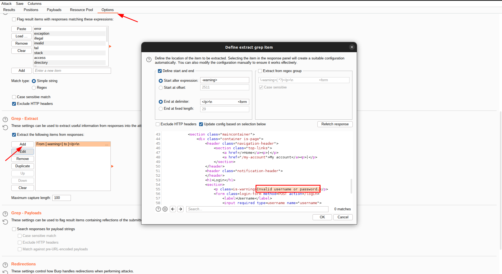
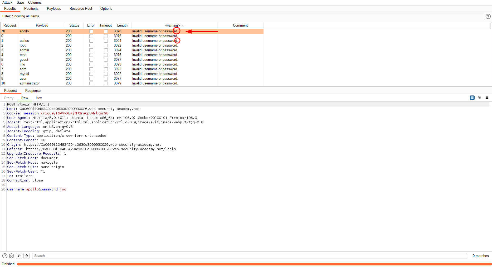
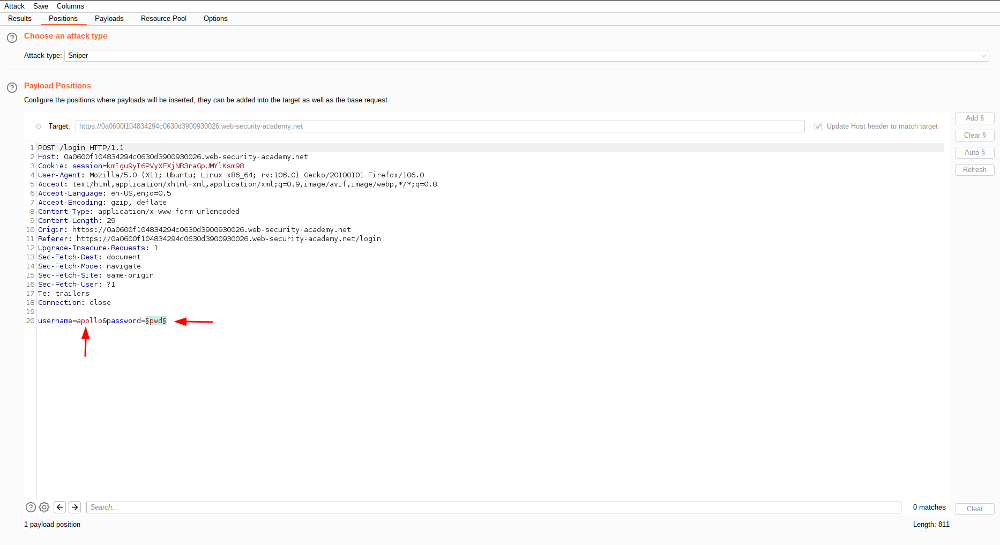
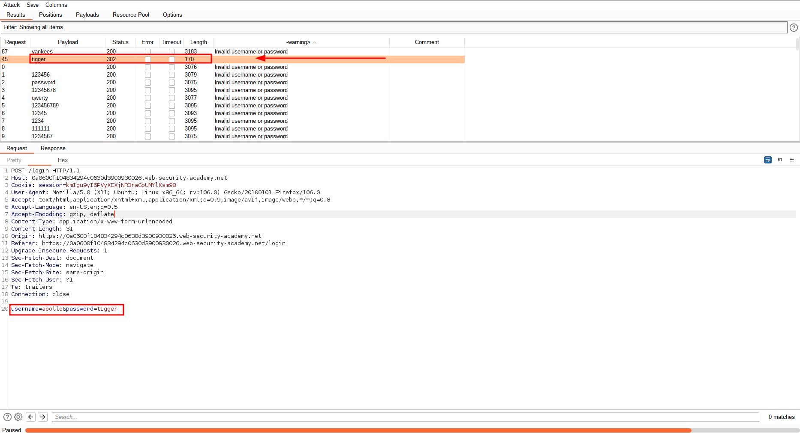
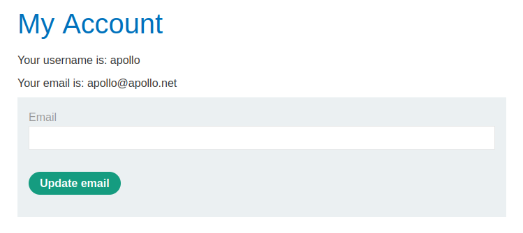

# Username enumeration via subtly different responses

[Lab in PortSwigger](https://portswigger.net/web-security/authentication/password-based/lab-username-enumeration-via-subtly-different-responses)

## Definition
Username enumeration is when an attacker is able to observe changes in the website's behavior in order to identify whether a given username is valid.

Username enumeration typically occurs either on the login page, for example, when you enter a valid username but an incorrect password, or on registration forms when you enter a username that is already taken. This greatly reduces the time and effort required to brute-force a login because the attacker is able to quickly generate a shortlist of valid usernames.

While attempting to brute-force a login page, you should pay particular attention to any differences in:

- **Status codes**: During a brute-force attack, the returned HTTP status code is likely to be the same for the vast majority of guesses because most of them will be wrong. If a guess returns a different status code, this is a strong indication that the username was correct. It is best practice for websites to always return the same status code regardless of the outcome, but this practice is not always followed.
- **Error messages**: Sometimes the returned error message is different depending on whether both the username AND password are incorrect or only the password was incorrect. It is best practice for websites to use identical, generic messages in both cases, but small typing errors sometimes creep in. Just one character out of place makes the two messages distinct, even in cases where the character is not visible on the rendered page.
- **Response times**: If most of the requests were handled with a similar response time, any that deviate from this suggest that something different was happening behind the scenes. This is another indication that the guessed username might be correct. For example, a website might only check whether the password is correct if the username is valid. This extra step might cause a slight increase in the response time. This may be subtle, but an attacker can make this delay more obvious by entering an excessively long password that the website takes noticeably longer to handle.

## Notes
This lab is subtly vulnerable to username enumeration and password brute-force attacks. It has an account with a predictable username and password, which can be found in the following wordlists:

 - [Candidate usernames](../../wordlist/usernames.txt)
 - [Candidate passwords](../../wordlist/passwords.txt)

To solve the lab, enumerate a valid username, brute-force this user's password, then access their account page.

**USERS ENUMERATION**  
The login feature doesn't implement any rate limit for requests or account blocking in case of too many wrong attempts. That said, the approach was to try multiple requests to the login endpoint with different users and look for a slight difference between the responses. The image below shows us how to configure the burp suite intruder to look for a piece of data in the response body and display it in the results tab:

In this case, we are looking for the exact message `Invalid username or password.`. But, what if the programmer doesn't have used a constant for this message? There is a chance that the message has a slight difference in other scenarios if it is hardcoded all over the place, as shown below:

That means probably the username is correct but the password (obviously) is wrong. The next step is to change the intruder attack configuration to brute force the password:

  

  

## Key Words
> brute force, user, enumeration, wordlist