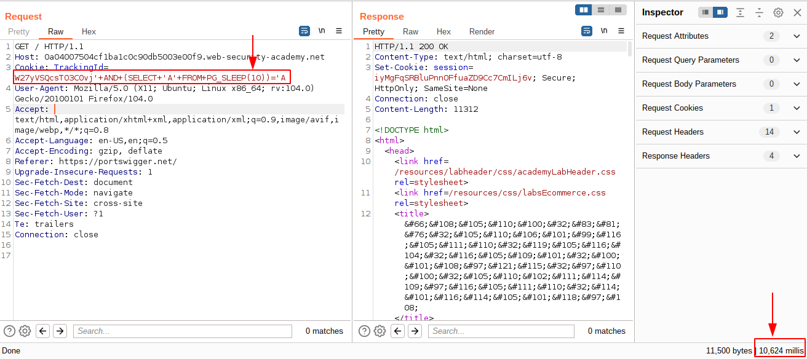
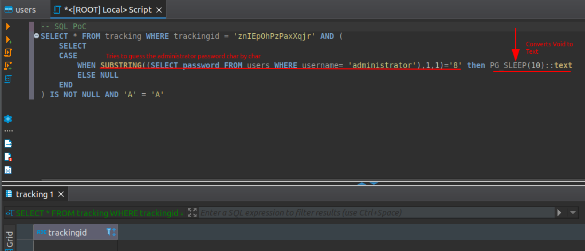
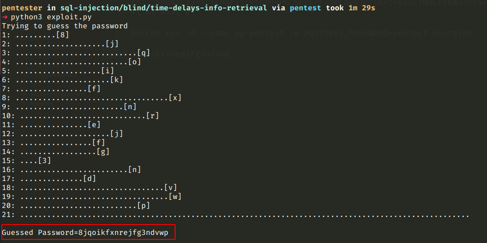
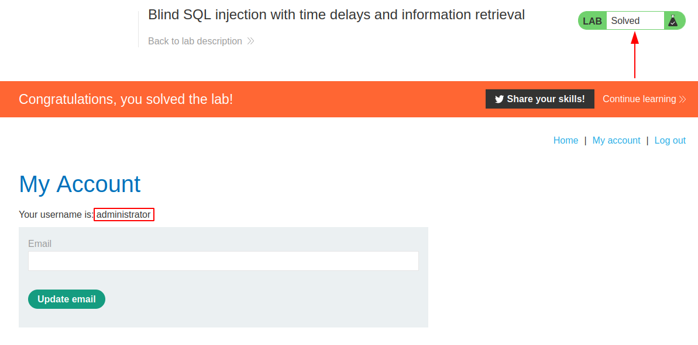

# Blind SQL injection with time delays and information retrieval

[Lab in PortSwigger](https://portswigger.net/web-security/sql-injection/blind/lab-time-delays-info-retrieval)

## Definition
In the preceding example, suppose that the application now catches database errors and handles them gracefully. Triggering a database error when the injected SQL query is executed no longer causes any difference in the application's response, so the preceding technique of inducing conditional errors will not work.

In this situation, it is often possible to exploit the blind SQL injection vulnerability by triggering time delays conditionally, depending on an injected condition. Because SQL queries are generally processed synchronously by the application, delaying the execution of an SQL query will also delay the HTTP response. This allows us to infer the truth of the injected condition based on the time taken before the HTTP response is received.

The techniques for triggering a time delay are highly specific to the type of database being used. On Microsoft SQL Server, input like the following can be used to test a condition and trigger a delay depending on whether the expression is true:
```sql
'; IF (1=2) WAITFOR DELAY '0:0:10'--
```
```sql
'; IF (1=1) WAITFOR DELAY '0:0:10'--
```

The first of these inputs will not trigger a delay, because the condition 1=2 is false. The second input will trigger a delay of 10 seconds, because the condition 1=1 is true.

Using this technique, we can retrieve data in the way already described, by systematically testing one character at a time:
```sql
'; IF (SELECT COUNT(Username) FROM Users WHERE Username = 'Administrator' AND SUBSTRING(Password, 1, 1) > 'm') = 1 WAITFOR DELAY '0:0:{delay}'--
```

## Notes
This lab contains a blind SQL injection vulnerability. The application uses a tracking cookie for analytics, and performs an SQL query containing the value of the submitted cookie.

The results of the SQL query are not returned, and the application does not respond any differently based on whether the query returns any rows or causes an error. However, since the query is executed synchronously, it is possible to trigger conditional time delays to infer information.

The database contains a different table called users, with columns called username and password. You need to exploit the blind SQL injection vulnerability to find out the password of the administrator user.

To solve the lab, log in as the administrator user.

**Vulnerability Confirmation**  
To confirm the vulnerability really exists, the simple SQL payload below was injected alongside the `trackindId` cookie parameter, instructing the **PostgreSQL DBMS** to wait for 10s to respond through the `PG_SLEEP` function. The response took more than this to return as expected, confirming that the system is vulnerable to blind SQL injection.

  

**Exploitation**  
Using the same principle explained above, a python script was crafted to exploit the vulnerability. The script sends a payload alongside the `trackingId` parameter aim to guess the password char by char.

The [exploit.py](exploit.py) makes a series of requests (char by char) containing the malicious payload in its `trackingId` cookie and every request that take more than the time specified in the delay configuration is considered as a char of the actual administrator password.

The image below shows how the parameter is interpreted as SQL in the backend:



The [exploit](exploit.py) in action:  


The lab result evidence:


## Key Words
> sql injection, blind, delay, python