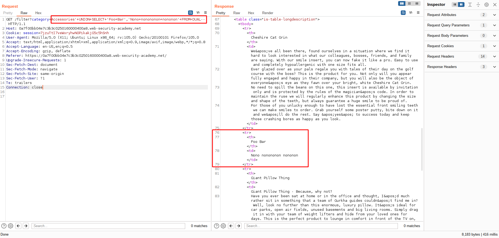
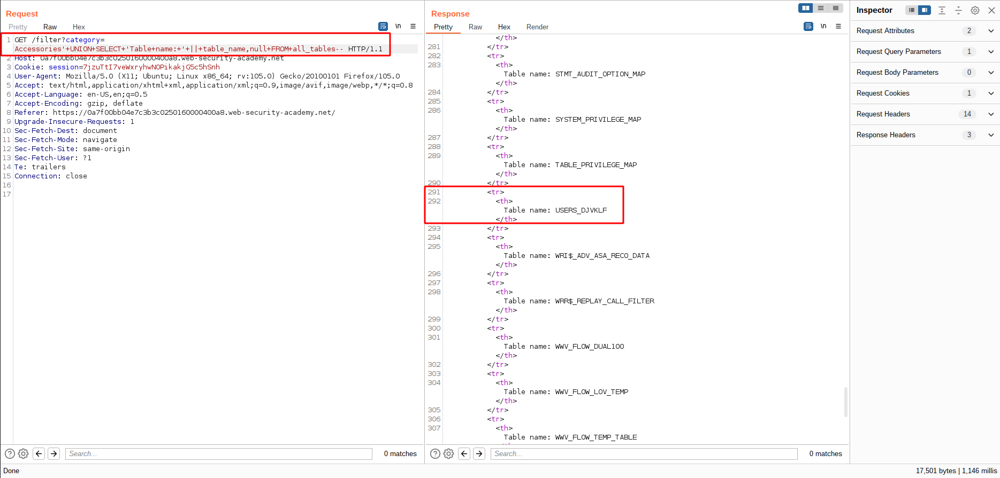
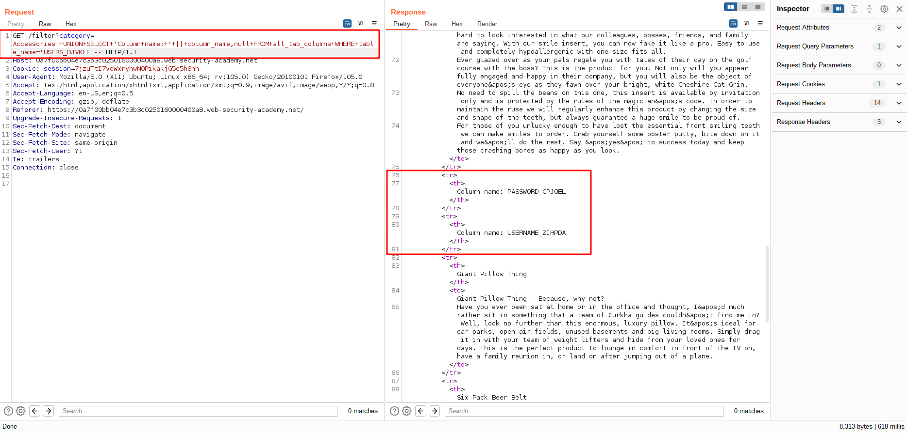
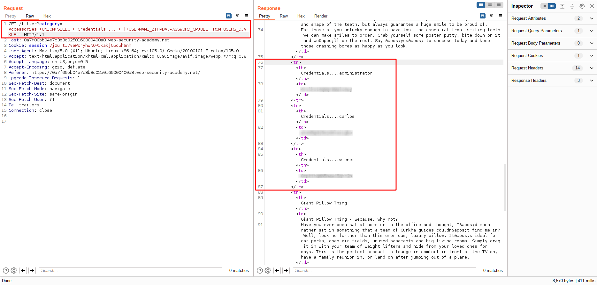
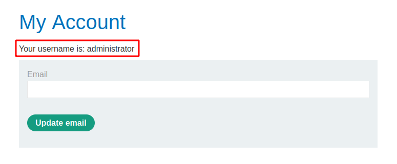

# SQL injection attack, listing the database contents on Oracle

[Lab in PortSwigger](https://portswigger.net/web-security/sql-injection/examining-the-database/lab-listing-database-contents-oracle)

## Definition
On Oracle, you can obtain the same information with slightly different queries.

You can list tables by querying all_tables:
```sql
SELECT * FROM all_tables
```

And you can list columns by querying all_tab_columns:
```sql
SELECT * FROM all_tab_columns WHERE table_name = 'USERS'
```

## Notes
This lab contains an SQL injection vulnerability in the product category filter. The results from the query are returned in the application's response so you can use a UNION attack to retrieve data from other tables.

The application has a login function, and the database contains a table that holds usernames and passwords. You need to determine the name of this table and the columns it contains, then retrieve the contents of the table to obtain the username and password of all users.

To solve the lab, log in as the administrator user.

**CONFIRMING VULNERABILITY**  
The union query technique is very useful in order to confirm that the vulnerability really exists and at the same time ensure that it is possible to inspect the database objects.  That said, the image below presents the payload sent to confirm both situations described previously:



**EXPLOIT**  
After that, was time to inspect the database objects and discover which table holds the users' credentials:



Knowing the table name, the next step was to discover the column names, and the most important: the column names where the username and password are stored:



After enumerating all database elements necessary, a payload was implemented and sent to the backend to dump all credentials stored in the users' table and solve the lab:





## Key Words
> sql injection, system databases, system tables