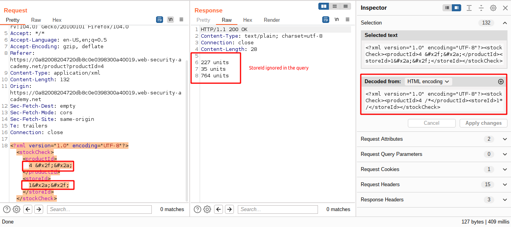
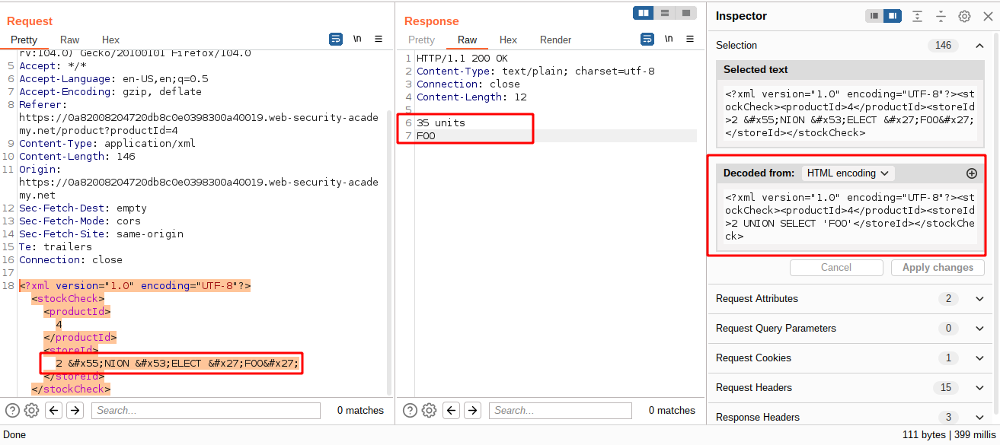
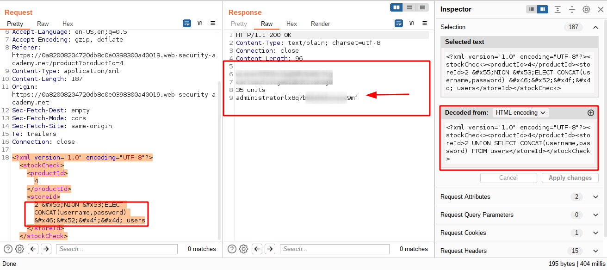
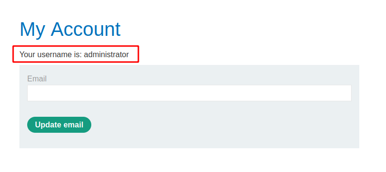

# SQL injection with filter bypass via XML encoding

[Lab in PortSwigger](https://portswigger.net/web-security/sql-injection/lab-sql-injection-with-filter-bypass-via-xml-encoding)

## Definition
In all of the labs so far, you've used the query string to inject your malicious SQL payload. However, it's important to note that you can perform SQL injection attacks using any controllable input that is processed as a SQL query by the application. For example, some websites take input in JSON or XML format and use this to query the database.

These different formats may even provide alternative ways for you to obfuscate attacks that are otherwise blocked due to WAFs and other defense mechanisms. Weak implementations often just look for common SQL injection keywords within the request, so you may be able to bypass these filters by simply encoding or escaping characters in the prohibited keywords. For example, the following XML-based SQL injection uses an XML escape sequence to encode the S character in SELECT:

```xml
<stockCheck>
    <productId>
        123
    </productId>
    <storeId>
        999 &#x53;ELECT * FROM information_schema.tables
    </storeId>
</stockCheck>
```

This will be decoded server-side before being passed to the SQL interpreter. 

## Notes
This lab contains a SQL injection vulnerability in its stock check feature. The results from the query are returned in the application's response, so you can use a UNION attack to retrieve data from other tables.

The database contains a users table, which contains the usernames and passwords of registered users. To solve the lab, perform a SQL injection attack to retrieve the admin user's credentials, then log in to their account. 

**CONFIRMING VULNERABILITY**  
To confirm the reported vulnerability, it was sent the usual SQL injection payload that comments out statements after a specific criteria as presented by the code snippet below:

```xml
...
<productId>
   4 --
</productId>
<storeId>
   2
</storeId>
...
```

However, somehow, the `storedId` wasn't ignored by the comment at the end of the `productId` filter. My guess is that exists a line break between each filter in the backend and when the query is executed it fails and the backend returns `0 units` as the response, but I don't know the real reason.

```sql
SELECT * FROM products 
WHERE 0 = 0 
   AND productId = 4 --
   AND storeId = 2
```

Betting on that, the line comment was switched to the block comment statement and the application responded as expected:



**EXPLOITATION**  
The first step was to try to return arbitrary information in conjunction with the main query. For that it was used the `union query` technique as shown below:



The next step was to craft a complete payload that gets the administrator username and password and return it alongside the stock units:





## Key Words
> sql injection, xml, hex, encoding, line break