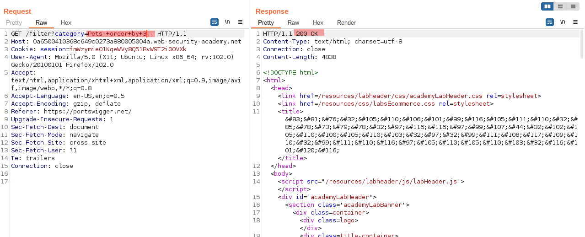
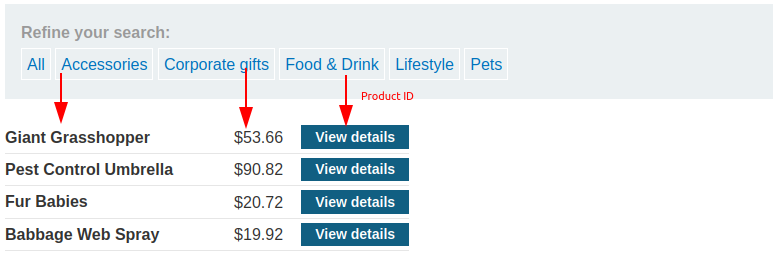
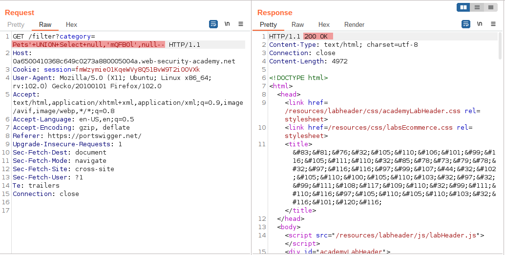
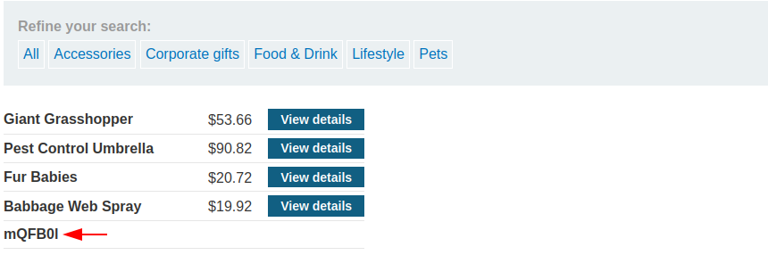

# SQL injection UNION attack, finding a column containing text

[Lab in PortSwigger](https://portswigger.net/web-security/sql-injection/union-attacks/lab-find-column-containing-text)

## Definition
The reason for performing an SQL injection UNION attack is to be able to retrieve the results from an injected query. Generally, the interesting data that you want to retrieve will be in string form, so you need to find one or more columns in the original query results whose data type is, or is compatible with, string data.

Having already determined the number of required columns, you can probe each column to test whether it can hold string data by submitting a series of UNION SELECT payloads that place a string value into each column in turn. For example, if the query returns four columns, you would submit:
```
' UNION SELECT 'a',NULL,NULL,NULL--
' UNION SELECT NULL,'a',NULL,NULL--
' UNION SELECT NULL,NULL,'a',NULL--
' UNION SELECT NULL,NULL,NULL,'a'--
```

If the data type of a column is not compatible with string data, the injected query will cause a database error, such as:
Conversion failed when converting the varchar value 'a' to data type int.

If an error does not occur, and the application's response contains some additional content including the injected string value, then the relevant column is suitable for retrieving string data. 

## Notes
This lab contains an SQL injection vulnerability in the product category filter. The results from the query are returned in the application's response, so you can use a UNION attack to retrieve data from other tables. To construct such an attack, you first need to determine the number of columns returned by the query. You can do this using a technique you learned in a previous lab. The next step is to identify a column that is compatible with string data.

The lab will provide a random value that you need to make appear within the query results. To solve the lab, perform an SQL injection UNION attack that returns an additional row containing the value provided. This technique helps you determine which columns are compatible with string data. 

**DETERMINE THE AMOUNT OF COLUMNS**  
The following picture shows the payload used in order to determine how many columns are present in the SQL statement:
  


Usually, developers order their queries by putting the ID first, followed by the name or description. The image highlight all points where each column is used:
  


The shot was to put the expected string in the second place, as a developer usually does:
  

  


## Key Words
> sql injection, union, varchar, column