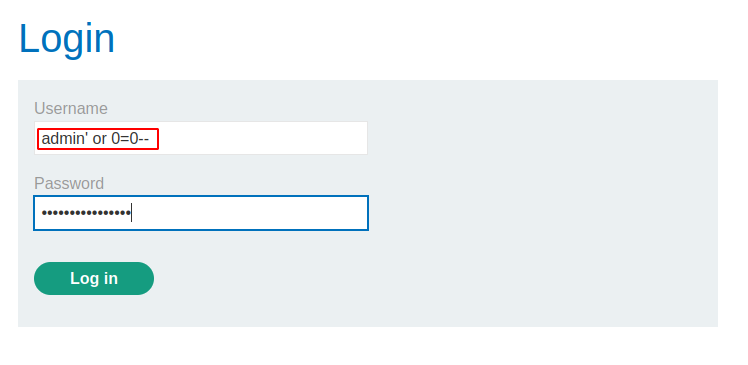
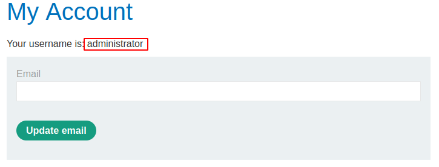

# SQL injection vulnerability allowing login bypass

[Lab in PortSwigger](https://portswigger.net/web-security/sql-injection/lab-login-bypass)

## Definition
Consider an application that lets users log in with a username and password. If a user submits the username wiener and the password bluecheese, the application checks the credentials by performing the following SQL query:
```sql
SELECT * FROM users WHERE username = 'wiener' AND password = 'bluecheese'
```

If the query returns the details of a user, then the login is successful. Otherwise, it is rejected.

Here, an attacker can log in as any user without a password simply by using the SQL comment sequence -- to remove the password check from the WHERE clause of the query. For example, submitting the username administrator'-- and a blank password results in the following query:
```sql
SELECT * FROM users WHERE username = 'administrator'--' AND password = ''
```

This query returns the user whose username is administrator and successfully logs the attacker in as that user. 

## Notes
This lab contains an SQL injection vulnerability in the login function.

To solve the lab, perform an SQL injection attack that logs in to the application as the administrator user.

**SQL INJECTION VULNERABILLITY**  
The following images demonstrate how is possible to completely bypass the authentication mechanism using SQL injection.




## Key Words
> sql injection, login bypass, password