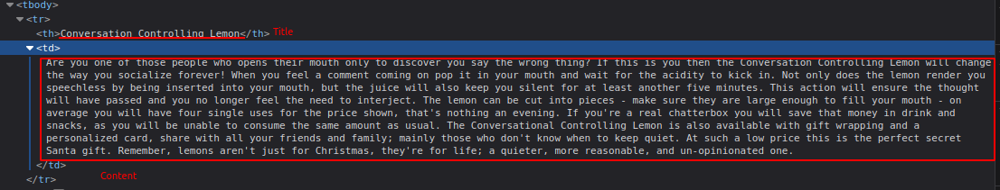
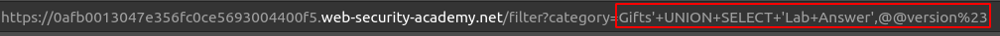
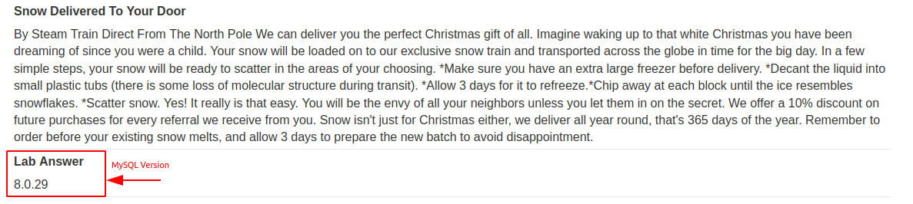

# SQL injection attack, querying the database type and version on MySQL and Microsoft

[Lab in PortSwigger](https://portswigger.net/web-security/sql-injection/examining-the-database/lab-querying-database-version-mysql-microsoft)

## Definition
Different databases provide different ways of querying their version. You often need to try out different queries to find one that works, allowing you to determine both the type and version of the database software.

The queries to determine the database version for some popular database types are as follows:

| Database type 	 | Query                   |
| ------------------ | ----------------------- |
| Microsoft, MySQL 	 | SELECT @@version        |
| Oracle 	         | SELECT * FROM v$version |
| PostgreSQL 	     | SELECT version()        |

For example, you could use a UNION attack with the following input:
```sql
' UNION SELECT @@version--
```

This might return output like the following, confirming that the database is Microsoft SQL Server, and the version that is being used:
```
Microsoft SQL Server 2016 (SP2) (KB4052908) - 13.0.5026.0 (X64)
Mar 18 2018 09:11:49
Copyright (c) Microsoft Corporation
Standard Edition (64-bit) on Windows Server 2016 Standard 10.0 <X64> (Build 14393: ) (Hypervisor)
```

## Notes
This lab contains an SQL injection vulnerability in the product category filter. You can use a `UNION` attack to retrieve the results from an injected query.

To solve the lab, display the database version string. 

**DETERMINING THE AMOUNT OF COLUMNS**  
Looking into the page source code using developer tools, is possible to determine that there are just two columns in the query, or that at least two columns have been used on the page.
  

  
**EXPLOITATION**
Two different payloads are used on this page and the difference between them was the comment statement. The SQL Server uses the widely used `--` to comment lines, while MySQL uses `#` to do it. The first attempt returned `500`, so the next try was with MySQL in mind:
  

  


## Key Words
> sql injection, version, mysql, sql server