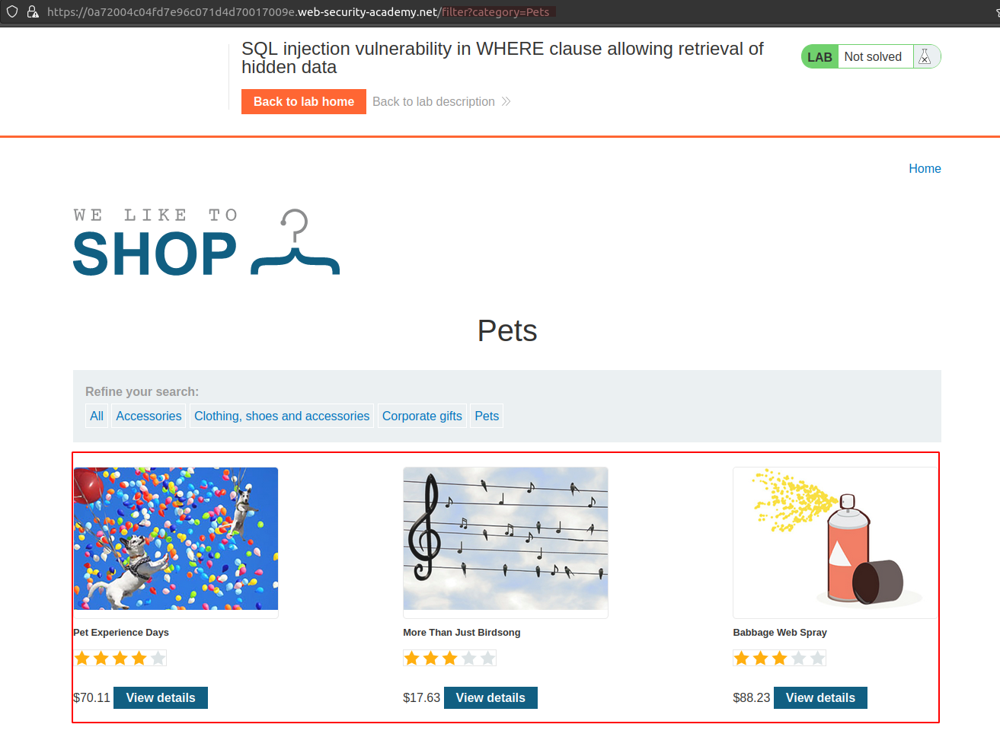
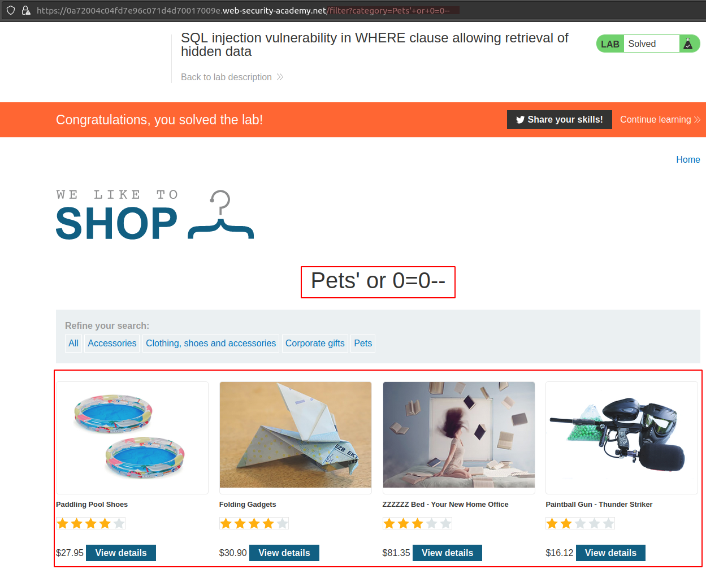

# SQL injection vulnerability in WHERE clause allowing retrieval of hidden data

[Lab in PortSwigger](https://portswigger.net/web-security/sql-injection/lab-retrieve-hidden-data)

## Definition
Consider a shopping application that displays products in different categories. When the user clicks on the Gifts category, their browser requests the URL: `https://insecure-website.com/products?category=Gifts`

This causes the application to make an SQL query to retrieve details of the relevant products from the database:
```sql
SELECT * FROM products WHERE category = 'Gifts' AND released = 1
```

This SQL query asks the database to return:
```
    all details (*)
    from the products table
    where the category is Gifts
    and released is 1.
```

The restriction `released = 1` is being used to hide products that are not released. For unreleased products, presumably `released = 0`.

The application doesn't implement any defenses against SQL injection attacks, so an attacker can construct an attack like: `https://insecure-website.com/products?category=Gifts'--`

This results in the SQL query:
```sql
SELECT * FROM products WHERE category = 'Gifts'--' AND released = 1
```

The key thing here is that the double-dash sequence `--` is a comment indicator in SQL, and means that the rest of the query is interpreted as a comment. This effectively removes the remainder of the query, so it no longer includes `AND released = 1`. This means that all products are displayed, including unreleased products.

Going further, an attacker can cause the application to display all the products in any category, including categories that they don't know about: `https://insecure-website.com/products?category=Gifts'+OR+1=1--`

This results in the SQL query:
```sql
SELECT * FROM products WHERE category = 'Gifts' OR 1=1--' AND released = 1
```

The modified query will return all items where either the category is Gifts, or 1 is equal to 1. Since 1=1 is always true, the query will return all items. 

## Notes
This lab contains an SQL injection vulnerability in the product category filter. When the user selects a category, the application carries out an SQL query like the following:
```sql
SELECT * FROM products WHERE category = 'Gifts' AND released = 1
```

To solve the lab, perform an SQL injection attack that causes the application to display details of all products in any category, both released and unreleased.

**FILTER BY CATEGORY PAGE**  
The image below shows how the application behaves when category's links are used to filter the products:

The application presents all the products of the chosen category as expected and produces a query string like: `/filter?category=filter?category=Pets`.
  
  
**SQL INJECTION VULNERABILITY**  
The next image presents the application bahavior when a malicious user injects the following payload into the query string: `/filter?category=filter?category=Pets'+or+0=0--`

Now, the filter doesn't respect the specified category and executes the following SQL statement:

```sql
SELECT * FROM products WHERE category = 'Pets' or 0=0--' AND released = 1
```

## Key Words
> sql injection