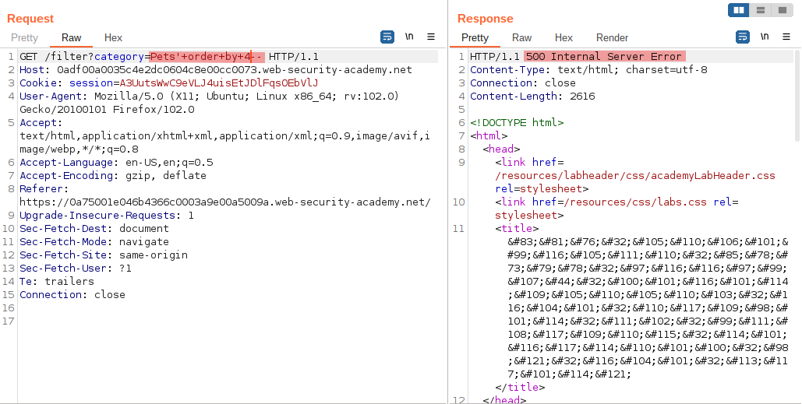
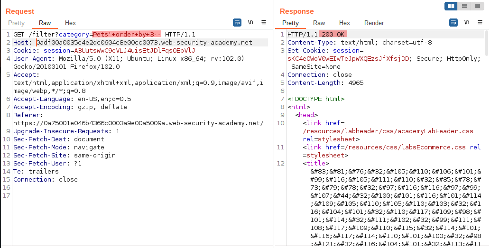
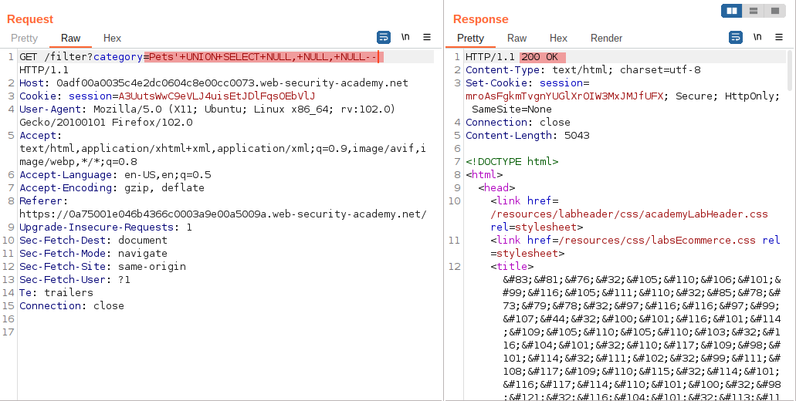
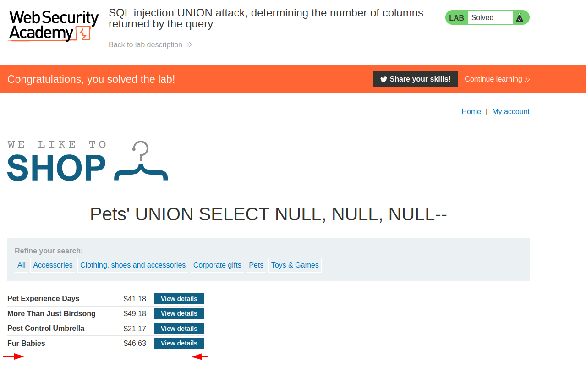

# SQL injection UNION attack, determining the number of columns returned by the query

[Lab in PortSwigger](https://portswigger.net/web-security/sql-injection/union-attacks/lab-determine-number-of-columns)

## Definition
When performing an SQL injection UNION attack, there are two effective methods to determine how many columns are being returned from the original query.

The first method involves injecting a series of ORDER BY clauses and incrementing the specified column index until an error occurs. For example, assuming the injection point is a quoted string within the WHERE clause of the original query, you would submit:

```
' ORDER BY 1--
' ORDER BY 2--
' ORDER BY 3--
etc.
```

This series of payloads modifies the original query to order the results by different columns in the result set. The column in an ORDER BY clause can be specified by its index, so you don't need to know the names of any columns. When the specified column index exceeds the number of actual columns in the result set, the database returns an error, such as:
The ORDER BY position number 3 is out of range of the number of items in the select list.

The application might actually return the database error in its HTTP response, or it might return a generic error, or simply return no results. Provided you can detect some difference in the application's response, you can infer how many columns are being returned from the query.

The second method involves submitting a series of UNION SELECT payloads specifying a different number of null values:
```
' UNION SELECT NULL--
' UNION SELECT NULL,NULL--
' UNION SELECT NULL,NULL,NULL--
etc.
```

If the number of nulls does not match the number of columns, the database returns an error, such as:
```
All queries combined using a UNION, INTERSECT or EXCEPT operator must have an equal number of expressions in their target lists.
```

Again, the application might actually return this error message, or might just return a generic error or no results. When the number of nulls matches the number of columns, the database returns an additional row in the result set, containing null values in each column. The effect on the resulting HTTP response depends on the application's code. If you are lucky, you will see some additional content within the response, such as an extra row on an HTML table. Otherwise, the null values might trigger a different error, such as a NullPointerException. Worst case, the response might be indistinguishable from that which is caused by an incorrect number of nulls, making this method of determining the column count ineffective. 

## Notes
This lab contains an SQL injection vulnerability in the product category filter. The results from the query are returned in the application's response, so you can use a UNION attack to retrieve data from other tables. The first step of such an attack is to determine the number of columns that are being returned by the query. You will then use this technique in subsequent labs to construct the full attack.

To solve the lab, determine the number of columns returned by the query by performing an SQL injection UNION attack that returns an additional row containing null values.

**DISCOVERING THE AMOUNT OF COLUMNS**  
The next two images shows the process to identify how many columns exists in the original SQL statement using Burp Suite.
  

  


Evidence points out that there are 3 columns in the SQL statement. With that, just change the payload to get the result as shown in the following image:
  


And the application will produce an empty line at the bottom of the grid as the result of this SQL Injection exploitation:
  


## Key Words
> sql injection, union, column, count