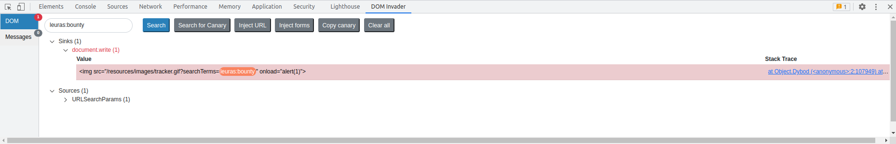
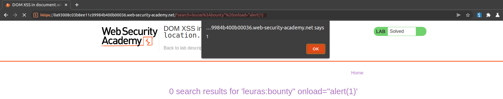

# DOM XSS in `document.write` sink using source `location.search`

[Lab in PortSwigger](https://portswigger.net/web-security/cross-site-scripting/dom-based/lab-document-write-sink)

## Definition
In principle, a website is vulnerable to DOM-based cross-site scripting if there is an executable path via which data can propagate from source to sink. In practice, different sources and sinks have differing properties and behavior that can affect exploitability, and determine what techniques are necessary. Additionally, the website's scripts might perform validation or other processing of data that must be accommodated when attempting to exploit a vulnerability. There are a variety of sinks that are relevant to DOM-based vulnerabilities. Please refer to the list below for details.

The document.write sink works with script elements, so you can use a simple payload, such as the one below:
```javascript
document.write('... <script>alert(document.domain)</script> ...');
```

## Notes
This lab contains a DOM-based cross-site scripting vulnerability in the search query tracking functionality. It uses the JavaScript document.write function, which writes data out to the page. The document.write function is called with data from location.search, which you can control using the website URL.

To solve this lab, perform a cross-site scripting attack that calls the alert function.

**Burp Suite DOM Invader Extension**  
The image below shows all occurrences found of the specified canary term in the application.
  


The following evidence shows how the application behaves when a malicious payload is sent through the `search` URL parameter.
  


## Key Words
> xss, dom-based, dom-invader