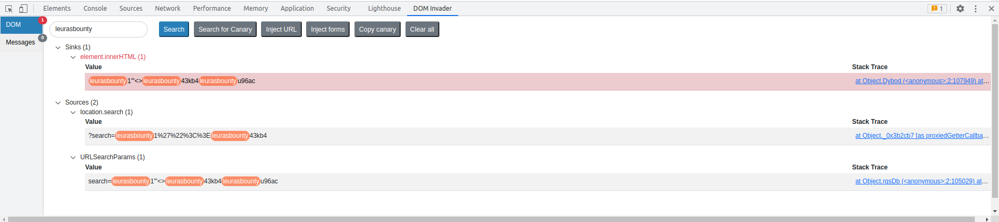
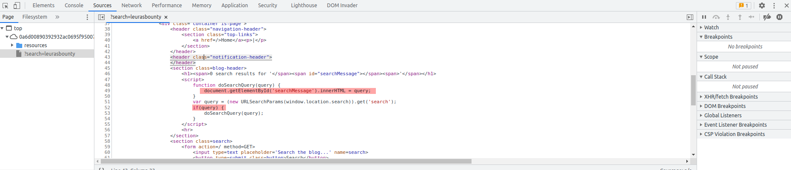

# DOM XSS in innerHTML sink using source 

[Lab in PortSwigger](https://portswigger.net/web-security/cross-site-scripting/dom-based/lab-innerhtml-sink)

## Definition
The innerHTML sink doesn't accept script elements on any modern browser, nor will svg onload events fire. This means you will need to use alternative elements like img or iframe. Event handlers such as onload and onerror can be used in conjunction with these elements. For example:
```javascript
element.innerHTML='...  ...'
```

## Notes
This lab contains a DOM-based cross-site scripting vulnerability in the search blog functionality. It uses an innerHTML assignment, which changes the HTML contents of a div element, using data from location.search.

To solve this lab, perform a cross-site scripting attack that calls the alert function.

**Burp Suite DOM Invader Extension**  
The image below shows all occurrences found of the specified canary term in the application.



**JavaScript code executed when the page is loaded**
```javascript
function doSearchQuery(query) {
    // injection point
    document.getElementById('searchMessage').innerHTML = query;
}

var query = (new URLSearchParams(window.location.search)).get('search');
// weak point. anything in the search URL parameter can be injected to the sink
if(query) {
    doSearchQuery(query);
}
```

The image below presents the actual vulnerable javascript code mentioned on the code snipet above.


**Malicious Payload** 
```html 
leuras:bounty
```

The following evidence shows how the application behaves when a malicious payload is sent through the `search` URL parameter.


## Key Words
> xss, bom-based, dom-invader